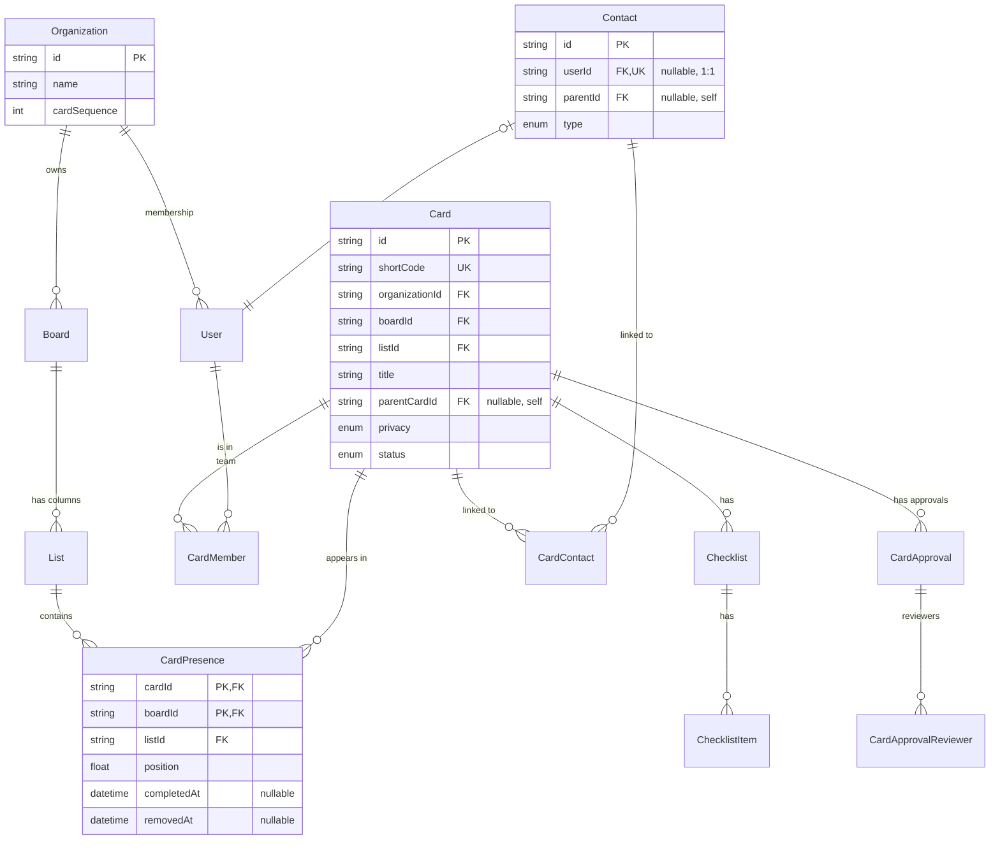

# Briefing — ER Diagram (Mermaid) + descrição do modelo de dados

> **Como usar:** cole este briefing num chat novo de Claude com acesso a este repositório. Fase 0 (Inventário) primeiro; aguarda aprovação antes de produzir.

---

## Contexto rápido do projeto

KTask. Banco: Postgres 16 via Prisma 6. Schema único em [apps/api/prisma/schema.prisma](../apps/api/prisma/schema.prisma). Multi-tenant via `organizationId`. Modelo principal gira em torno de: `Organization → Board → List → Card`, com `CardPresence` permitindo cards multi-fluxo (N:N), `User/Membership` pra controle de acesso, `Checklist/ChecklistItem`, `Comment`, `Attachment`, `Approval`, `Automation`, `Contact`, `Activity`, etc.

---

## Objetivo desta sessão

Produzir um **diagrama ER visual + descrição textual** do modelo de dados, em **Mermaid** (compatível com renderização nativa do GitHub e VS Code).

**Audiência**: dev novo querendo entender o modelo. Pessoa de produto avaliando complexidade. DBA externo eventual.

**Entregáveis**:

- `docs/data-model/README.md` — descrição textual organizada por subsistema
- `docs/data-model/er-diagram.md` — diagrama Mermaid principal
- `docs/data-model/er-by-area.md` — diagramas Mermaid menores por subsistema (kanban, automações, CRM, etc) — porque o ER total fica ilegível.

Formato: Markdown + blocos ` ```mermaid `.

**Restrições**:

- Sem emojis.
- Diagrama total **NÃO** deve tentar caber tudo numa imagem (ilegível). Divide em 4-6 diagramas por área.
- Marca PKs e FKs claramente. Marca campos UNIQUE e índices compostos relevantes (`@@unique`, `@@index`).
- Nomes EXATOS do schema (`Card`, não `card` ou `Cards`).
- Cardinalidades corretas (1:N, N:N, 1:1 condicional como `Contact ↔ User`).
- Não documenta campos triviais (`createdAt`, `updatedAt`) no diagrama; menciona como convenção geral no texto.

---

## Fase 0 — Inventário forçado

### Leituras obrigatórias

1. [apps/api/prisma/schema.prisma](../apps/api/prisma/schema.prisma) — **leia inteiro**, é a fonte de verdade.
2. [tarefas-md/03-entidades-e-dominio.md](../tarefas-md/03-entidades-e-dominio.md) — visão de produto do domínio
3. [tarefas-md/13-cards-multi-fluxo.md](../tarefas-md/13-cards-multi-fluxo.md) — `CardPresence`
4. [tarefas-md/17-familia-cards.md](../tarefas-md/17-familia-cards.md) — `parentCardId`
5. [tarefas-md/19-contatos-externos.md](../tarefas-md/19-contatos-externos.md) + [tarefas-md/50-contact-user-vinculo.md](../tarefas-md/50-contact-user-vinculo.md) — Contact

### Exploração estruturada

- Conte quantos modelos existem no schema (`grep -c "^model "`).
- Lista todos os enums.
- Agrupa modelos em **subsistemas** (proposta inicial — você decide a divisão):
  - **Tenancy**: Organization, User, Membership, Invitation
  - **Kanban**: Board, List, Card, CardPresence, CardMember, CardLabel, Label
  - **Conteúdo do card**: Checklist, ChecklistItem, Comment, Attachment, ChecklistTemplate
  - **Aprovações**: CardApproval, CardApprovalReviewer, ApprovalAction
  - **Automação**: Automation, AutomationRun, Trigger, Action
  - **CRM**: Contact, CardContact
  - **Mensageria**: MessageTemplate, WhatsappInstance, PushSubscription
  - **Auditoria**: Activity, PasswordResetToken, RefreshToken
  - **Time tracking**: TimeEntry (se existir)
  - **Recorrência/Task** (Doc 49): Task
- Confirma as cardinalidades olhando `@relation` no schema.

### Saída da Fase 0

```
## Inventário (Fase 0)

### Contagem
- Modelos: N
- Enums: M
- Indexes compostos: K

### Modelos por subsistema (proposta)
1. Tenancy (X modelos): Organization, User, Membership, Invitation
2. Kanban core (Y modelos): Board, List, Card, ...
3. ...

### Relações N:N (com tabela join)
1. Board ↔ Card via CardPresence
2. Card ↔ Contact via CardContact
3. Card ↔ Label via CardLabel
4. ...

### Relações 1:N notáveis
1. Organization → Board (cascade)
2. ...

### Relações 1:1 (raras)
1. Contact ↔ User via Contact.userId (unique)
2. ...

### Auto-relações (self-reference)
1. Card.parentCardId → Card (família de cards)
2. Contact.parentId → Contact (PERSON pertence a COMPANY)
3. ...

### Enums críticos
1. CardPrivacy (PUBLIC, TEAM_ONLY)
2. ContactType (PERSON, COMPANY)
3. ActivityType (N valores)
4. ...

### Coisas que vou DEIXAR DE FORA do diagrama principal
- Campos createdAt/updatedAt (convenção)
- Campos de soft-delete (deletedAt) — menciono no texto
- Subsistema X — fora de escopo se: [...]

### Coisas que precisam ATENÇÃO
- Modelo Y tem N FKs — vai ficar denso, devo isolar num sub-diagrama
- ...

**Aguardo aprovação ou correção antes de produzir os diagramas.**
```

---

## Fase 1 — Produção

Após aprovação:

### 1. `docs/data-model/README.md`

Estrutura:

```markdown
# Modelo de dados

## Visão geral

[Parágrafo curto: tipo de banco, ORM, convenção de tenant, soft-delete, timestamps.]

## Convenções universais

- Todo modelo "tenant-aware" tem `organizationId` (FK pra Organization, cascade).
- Timestamps: `createdAt` (default now), `updatedAt` (Prisma autoupdate).
- Soft-delete: campo `deletedAt` em models que precisam histórico (Contact, Card?, ...).
- IDs: CUID via `@id @default(cuid())`.
- Cardinalidades: ...

## Subsistemas

Cada subsistema com link pro diagrama dedicado:

| Subsistema | Modelos                                    | Diagrama                                       |
| ---------- | ------------------------------------------ | ---------------------------------------------- |
| Tenancy    | Organization, User, Membership, Invitation | [er-by-area.md#tenancy](er-by-area.md#tenancy) |
| Kanban     | Board, List, Card, CardPresence, ...       | [er-by-area.md#kanban](er-by-area.md#kanban)   |
| ...        | ...                                        | ...                                            |

## Decisões de modelagem importantes

### Multi-fluxo via CardPresence

[Parágrafo explicando: Card tem dados; CardPresence(cardId, boardId) é onde ele aparece. PK composta (cardId, boardId) garante "1 card só está em 1 lista por board". Trade-off: Card.boardId virou legacy.]

### Contact ↔ User (1:1)

[...]

### Soft-delete vs hard-delete

[...]

### Privacidade de card

[...]

## Diagramas

- [Diagrama geral simplificado](er-diagram.md) — só os 10-12 modelos centrais
- [Diagramas por subsistema](er-by-area.md) — detalhado
```

### 2. `docs/data-model/er-diagram.md`

Um diagrama Mermaid `erDiagram` com **os ~10-12 modelos centrais** (não todos). Exemplo:



### 3. `docs/data-model/er-by-area.md`

Cada subsistema com sub-diagrama Mermaid focado, texto curto explicando o que faz e as decisões críticas. 5-8 sub-diagramas (kanban, tenancy, conteúdo, aprovações, automação, CRM, mensageria, auditoria).

Exemplo de cabeçalho de cada seção:

````markdown
## Kanban {#kanban}

Modelos principais: `Board`, `List`, `Card`, `CardPresence`, `Label`, `CardLabel`.

Decisões críticas:

- Card multi-fluxo: ver `ADR-0003`.
- Position usa Float (não Int) pra inserções entre cards sem reindexar tudo.

```mermaid
erDiagram
    ...
```
````

```

---

## Fase 2 — Auto-auditoria

1. **Acuracidade**: cada `erDiagram` corresponde **exatamente** ao schema.prisma? Cardinalidades certas?
2. **Cobertura**: todos os modelos identificados na Fase 0 estão em ALGUM diagrama (geral ou por área)?
3. **Renderização**: cada bloco mermaid renderiza no GitHub sem erro de sintaxe? (Cuidado com strings com aspas, mermaid é estrito.)
4. **Entrega**:

```

## Resumo da entrega

- Arquivos gerados: docs/data-model/README.md, er-diagram.md, er-by-area.md
- Modelos cobertos no diagrama geral: X/N
- Modelos cobertos em sub-diagramas: Y/N
- Modelos NÃO cobertos (e por quê): [lista, ou "nenhum"]
- Trade-offs de simplificação: [ex: omiti campos auxiliares de Y porque inflavam o diagrama]

```

---

## Notas gerais

- Sem emojis.
- Mermaid `erDiagram` (não classDiagram).
- Cardinalidade Mermaid: `||--o{` = 1 obrigatório → 0..N. `|o--||` = 0..1 → 1.
- Não inventa coluna que não existe.
- Em dúvida sobre incluir campo num diagrama, prefira omitir (mantém legibilidade) e cite no texto.
```
