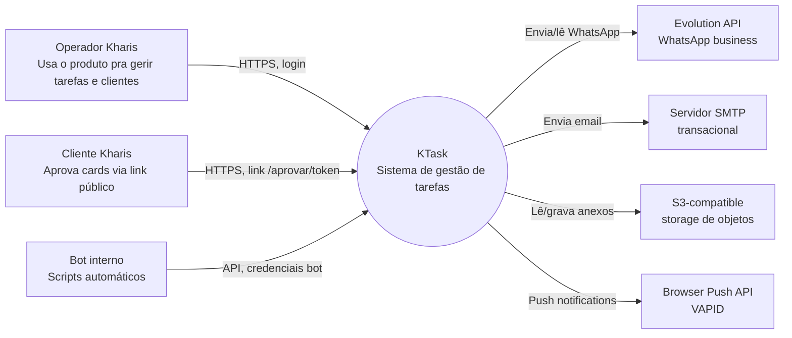
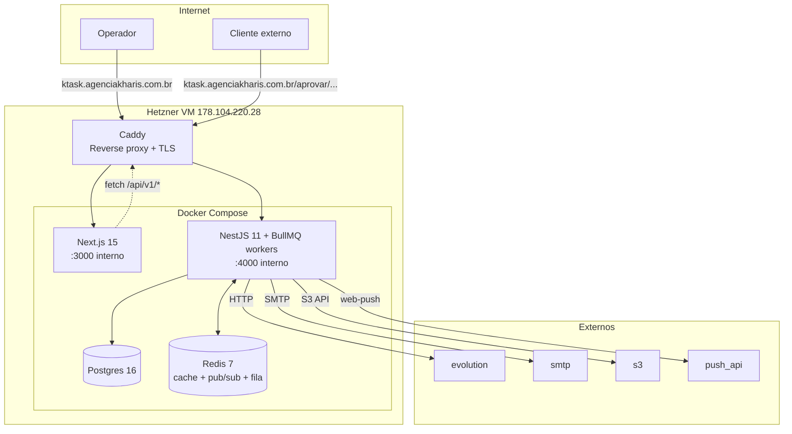

# Briefing — Architecture overview (C4 nível 1+2)

> **Como usar:** cole este briefing num chat novo de Claude com acesso a este repositório. Fase 0 (Inventário) primeiro; aguarda aprovação antes de produzir.

---

## Contexto rápido do projeto

KTask. Monorepo NestJS + Next.js + Prisma + Postgres + Redis + BullMQ + Socket.IO + Evolution API + S3-compatible. Em produção numa Hetzner VM. Multi-tenant. Uso interno hoje, planos SaaS no futuro.

---

## Objetivo desta sessão

Produzir uma **visão de arquitetura de 1 página** (densa mas legível) seguindo o modelo C4 nos níveis 1 (Context) e 2 (Container). Não é mergulho profundo — é o mapa que um arquiteto novo precisaria pra "saber onde está o quê" antes de cavar no código.

**Audiência**:

- Dev novo (complementa onboarding)
- Avaliador externo (consultor, contratante, futuro investidor)
- Você mesmo daqui a 1 ano querendo lembrar

**Entregável**:

- `docs/architecture.md` — uma página densa, ~250-400 linhas, com diagramas Mermaid (C4 Level 1 + Level 2)

**Restrições**:

- Sem emojis.
- C4 Level 1 = "sistema na caixa preta + atores externos". Level 2 = "containers internos do sistema (api, web, db, redis, ...) + integrações externas".
- NÃO entra em Level 3 (componentes/módulos internos) — esse vira docs separadas se precisar.
- Mermaid puro (`flowchart`, `C4Context` se suportado; senão `flowchart` com convenção).
- Não floreio. Cada caixa explica o quê faz.

---

## Fase 0 — Inventário forçado

### Leituras obrigatórias

1. [tarefas-md/00-visao-geral.md](../tarefas-md/00-visao-geral.md)
2. [tarefas-md/05-stack-e-arquitetura.md](../tarefas-md/05-stack-e-arquitetura.md)
3. [tarefas-md/10-deploy-producao.md](../tarefas-md/10-deploy-producao.md)
4. [infra/docker-compose.prod.yml](../infra/docker-compose.prod.yml) (ou equivalente)
5. [infra/Caddyfile](../infra/Caddyfile) (se existir)
6. [apps/api/src/main.ts](../apps/api/src/main.ts) — pra ver bootstrap, módulos importados, Socket.IO setup
7. README raiz (se já gerado)
8. ER diagram (se já gerado) — pra inventário rápido de domínio

### Exploração estruturada

- **Atores externos** que interagem com o KTask:
  - Usuários internos da Kharis (operadores)
  - Clientes externos da Kharis (via link público de aprovação)
  - Sistemas externos: Evolution API (WhatsApp), SMTP (mailing), S3-compatible (storage), Push (browsers)
- **Containers internos**:
  - Frontend Next.js
  - Backend NestJS
  - Postgres
  - Redis
  - Workers BullMQ (parte do mesmo processo NestJS? ou separados? — confirmar no Compose)
  - Caddy (reverse proxy + TLS)
- **Fluxos de dados típicos**:
  - User cria card → API → DB + Realtime → Web (todos conectados)
  - Automação dispara → fila → worker → ação (ex: WhatsApp → Evolution)
  - Cliente aprova → token público → API → DB → realtime ao dono do card

### Saída da Fase 0

```
## Inventário (Fase 0)

### Atores externos
1. Operador Kharis (usuário logado) — entra via web, exerce todas as ações do produto
2. Cliente externo Kharis (não logado) — acessa link público /aprovar/[token] pra aprovar cards
3. Bot (claude-bot@ktask.local) — usado por scripts ad-hoc com credenciais bot

### Sistemas externos (saídas)
1. Evolution API — envio/leitura WhatsApp
2. SMTP — emails transacionais (Mailpit dev, SES/SMTP real prod)
3. S3-compatible — storage de anexos (MinIO dev, ??? prod)
4. Push API (VAPID) — web push notifications

### Sistemas externos (entradas)
1. GitHub Actions → Hetzner VM (deploy automático)
2. Webhook Evolution (se houver — confirmar)

### Containers internos (em produção)
1. ktask-api (NestJS 11 + Socket.IO + BullMQ workers no mesmo processo? confirmar)
2. ktask-web (Next.js 15)
3. ktask-postgres (Postgres 16)
4. ktask-redis (Redis 7)
5. caddy (TLS + reverse proxy)
[Confirmar se workers BullMQ estão no mesmo processo do api ou em container separado.]

### Fluxos críticos
1. Login: web → POST /auth/login → JWT cookies httpOnly
2. Criar card: web → POST /cards → DB INSERT (Card + CardPresence) → emit event → Socket.IO → web (clientes conectados)
3. Automação dispara: event no api → enqueue BullMQ → worker pega → execute action (ex: send WhatsApp via Evolution)
4. Aprovação cliente: cliente acessa /aprovar/[token] → web carrega public/approvals/:token → cliente decide → POST decide → API atualiza → automação onApprove/onReject roda
5. Anexo: web faz signed upload pra S3 → registra Attachment na DB

### Multi-tenant
- Decisão: shared schema com organizationId
- Todos os queries via Prisma filtram organizationId via TenantContext (CurrentOrg decorator)

### Real-time
- Socket.IO com adapter Redis (escala horizontal possível mas não usado hoje — 1 instância)
- Rooms por boardId, cardId, orgId

### Deploy
- GitHub Actions → build image GHCR → SSH Hetzner → docker compose pull+up → healthcheck

### Coisas que vou DEIXAR DE FORA
- Detalhes internos de cada módulo (vai pra docs específicas)
- Detalhes de schema (já em docs/data-model)
- Roadmap (já em tarefas-md/06)

**Aguardo aprovação ou correção antes de produzir o doc.**
```

---

## Fase 1 — Produção

Após aprovação, `docs/architecture.md`:

````markdown
# Arquitetura — KTask

Documento "1 página" pra entender o sistema sem cavar no código. Foco em **Context** (sistema como caixa preta com atores) e **Container** (peças internas + integrações). Detalhamento de cada container fica em docs específicas.

## Sumário

- [Resumo executivo](#resumo)
- [C4 Nível 1 — Context](#contexto)
- [C4 Nível 2 — Container](#containers)
- [Decisões-chave](#decisões-chave)
- [Onde ler mais](#onde-ler-mais)

## Resumo {#resumo}

[2-3 parágrafos. O que KTask faz, pra quem, com que stack, em que ambiente. Idealmente o leitor saí daqui sabendo "esse sistema é Y, roda Z, tem K".]

## C4 Nível 1 — Context {#contexto}

Quem usa o sistema, com quem ele fala.


````

[Texto curto descrevendo: o que cada ator faz, o que cada sistema externo provê. Sem repetir o que está no diagrama.]

## C4 Nível 2 — Container {#containers}

Peças internas do sistema em produção.



### Container: web (Next.js 15)

- Função: SPA com SSR via App Router. UI completa.
- Auth: JWT em cookie httpOnly (set pelo api).
- Real-time: Socket.IO client conectando ao api via Caddy.
- Tecnologias: React 19, Tailwind, Tiptap (editor), TanStack Query, Zustand.

### Container: api (NestJS 11)

- Função: REST + WebSocket + workers BullMQ (mesmo processo).
- Estrutura: 30 módulos (auth, cards, boards, automations, ...).
- Auth: JWT access (15min) + refresh em cookie. Roles OWNER/ADMIN/GESTOR/EDITOR/MEMBER/REVIEWER.
- Multi-tenant: TenantContext via decorator, todos os queries filtram organizationId.
- Bootstrap: `apps/api/src/main.ts`.
- Migrations: rodam no startup do container (`prisma migrate deploy` no CMD do Dockerfile).

### Container: db (Postgres 16)

- Single instance, persistência via volume Docker.
- Backup automático: `scripts/ops/backup.sh` (verificar frequência/retention).
- Schema completo em [apps/api/prisma/schema.prisma](../apps/api/prisma/schema.prisma).
- Multi-tenant shared schema (todos os modelos têm organizationId).

### Container: redis (Redis 7)

- Função tripla:
  1. **Cache** (rate-limit, sessões temporárias)
  2. **Pub/sub** pro Socket.IO adapter (escala horizontal possível)
  3. **BullMQ** filas (jobs assíncronos)

### Container: caddy

- Reverse proxy + TLS automático (Let's Encrypt).
- Domínios: `ktask.agenciakharis.com.br` (web), `api.ktask.agenciakharis.com.br` (api).
- Config em `infra/Caddyfile`.

## Decisões-chave {#decisões-chave}

[Lista de 6-10 decisões com 1 linha cada e link pra ADR correspondente.]

- Monorepo pnpm + Turborepo — [ADR-0001](adr/0001-monorepo-pnpm-turborepo.md)
- Multi-tenant shared schema via organizationId — [ADR-0002](adr/0002-multi-tenant-organizationid.md)
- Cards multi-fluxo via CardPresence (M:N) — [ADR-0003](adr/0003-cards-multi-fluxo-cardpresence.md)
- Hetzner VM em vez de AWS — [ADR-0004](adr/0004-deploy-hetzner-vs-aws.md)
- Evolution API em vez de Meta Cloud — [ADR-0005](adr/0005-evolution-api-vs-meta-cloud-api.md)
- ...

## Estado atual vs roadmap

- Em produção: kanban + automações básicas + aprovações + CRM + recorrência
- Fase 2 (parcial): WhatsApp bidirecional, time tracking, dashboards
- Parkado: SaaS multi-org externa, billing, landing
- Detalhes: [tarefas-md/06-roadmap-mvp.md](../tarefas-md/06-roadmap-mvp.md)

## Onde ler mais {#onde-ler-mais}

- Setup local: [README.md](../README.md)
- Modelo de dados: [docs/data-model/README.md](data-model/README.md)
- API: [docs/api/README.md](api/README.md)
- Runbooks operacionais: [docs/runbooks/](runbooks/)
- Decisões: [docs/adr/](adr/)
- Postmortems: [docs/postmortems/](postmortems/)
- Planejamento de produto: [tarefas-md/](../tarefas-md/)

## Histórico

- 2026-MM-DD: criado a partir do briefing [08-architecture-overview.md](../briefings/08-architecture-overview.md)

```

---

## Fase 2 — Auto-auditoria

1. **Os diagramas Mermaid renderizam?** (Sintaxe correta — strings sem aspas estranhas, setas válidas).
2. **Cada decisão-chave aponta pra ADR existente?** Se ADR ainda não foi gerada, deixa o link "morto" mas marca no relatório.
3. **Estado atual realista?** Não pinta features parciais como prontas.
4. **Entrega**:

```

## Resumo da entrega

- Arquivo: docs/architecture.md
- Linhas: ~XXX
- Diagramas: 2 (Context + Container)
- Decisões-chave listadas: N (de M existentes)
- Inferências sem confirmação: [lista — ex: "assumi que workers BullMQ rodam no mesmo processo do api; confirmar em docker-compose"]
- Sugestões de follow-up: [ex: "criar diagrama Level 3 do módulo automations"]

```

---

## Notas gerais

- Sem emojis.
- Não duplica conteúdo que já vive em outras docs (ER diagram, runbooks). Aponta com link.
- Tom: panorâmico, denso, sem prosa redundante.
- Em dúvida, pergunte.
```
