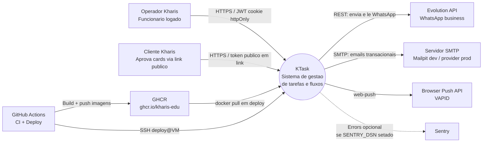
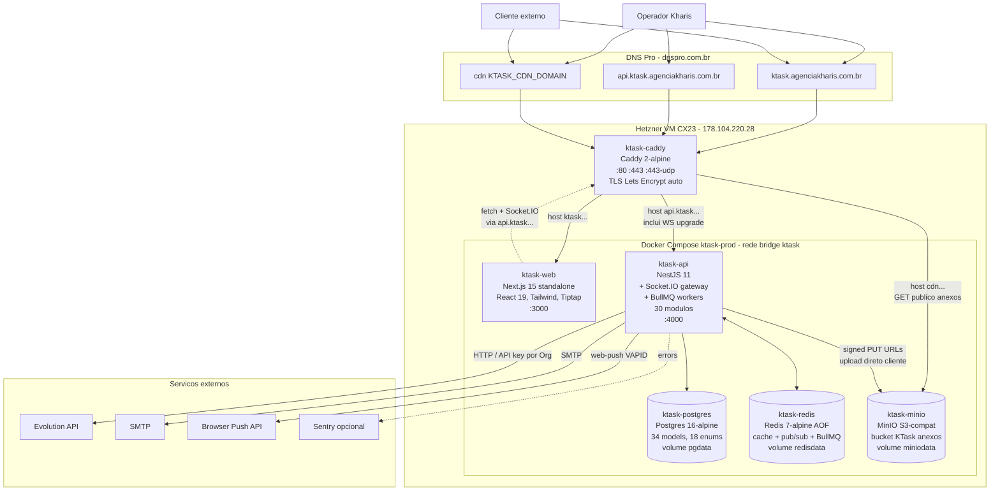

# Arquitetura — KTask

Documento "1 página" para entender o sistema sem cavar no código. Foco em **Context** (sistema como caixa preta com atores) e **Container** (peças internas + integrações). Detalhamento de cada container fica em docs específicas — apontadas na seção [Onde ler mais](#onde-ler-mais).

## Sumário

- [Resumo](#resumo)
- [C4 Nível 1 — Context](#contexto)
- [C4 Nível 2 — Container](#containers)
- [Decisões-chave](#decisões-chave)
- [Estado atual vs roadmap](#estado-atual)
- [Onde ler mais](#onde-ler-mais)
- [Histórico](#histórico)

## Resumo {#resumo}

KTask é o sistema interno de gestão de tarefas e fluxos operacionais da Kharis. Kanban multi-fluxo (cards podem estar em mais de um quadro via `CardPresence`) com automações próprias, aprovações por cliente externo via link público, CRM leve e integração WhatsApp via Evolution API. Multi-tenant desde o dia zero (`organizationId` em quase todas as tabelas), embora hoje só uma organização real esteja em produção. O foco atual é uso interno; SaaS é horizonte sem prazo (ver [tarefas-md/00-visao-geral.md](../tarefas-md/00-visao-geral.md)).

Stack: monorepo pnpm + Turborepo. Backend NestJS 11 com Socket.IO gateway e workers BullMQ no mesmo processo, sobre Postgres 16 + Redis 7 + Prisma 6. Frontend Next.js 15 (App Router, React 19). Storage S3-compatible self-hosted via MinIO no mesmo Compose — **o sistema não depende de S3 externo em produção**, decisão arquitetural deliberada (custo previsível, dados sob controle, sem vendor lock; ver [Decisões-chave](#decisões-chave)).

Em produção numa única VM Hetzner Cloud (CX23, ~R$ 34/mês) com Docker Compose + Caddy + TLS automático. Deploy é GitHub Actions em push para `main`: build de imagens → GHCR → SSH para a VM → `compose pull + up` → healthcheck → smoke test HTTPS. Custo total de runtime é dezenas de reais/mês; substituível a qualquer momento por outra VM ou pelo Kubernetes quando o SaaS justificar (ver [ADR-0004](adr/0004-deploy-hetzner-vs-aws.md)).

## C4 Nível 1 — Context {#contexto}

Quem usa, com quem o sistema fala em produção.

**Atores humanos**:

- **Operador Kharis** — funcionário da empresa, logado por JWT (access 15min + refresh em cookie httpOnly). Usa toda a UI: cria/move cards, define automações, aprova revisões, opera o CRM. Operadores também rodam scripts ad-hoc localmente (audit, import, watchdog) usando credenciais bot — não é um ator separado, é o próprio operador via CLI.
- **Cliente externo Kharis** — não tem conta no KTask. Recebe um link `/aprovar/[token]` (geralmente por WhatsApp via automação), abre, aprova ou reprova. O token é a única autenticação.

**Sistemas externos** (saídas do KTask):

- **Evolution API** — instância de WhatsApp business gerenciada pela Kharis (não é serviço da Meta direto; ver [ADR-0005](adr/0005-evolution-api-vs-meta-cloud-api.md)). Config por organização em `Integration.config`, criptografada com `INTEGRATION_ENCRYPTION_KEY`. Disparada por automações (`SEND_WHATSAPP`) e por envio direto do operador.
- **SMTP** — transacional (welcome, recuperação de senha, notificações que viram email). Mailpit em dev; provedor SMTP real em prod via `SMTP_HOST/PORT/USER/PASS`.
- **Browser Push API** — Web Push com par VAPID (`VAPID_PUBLIC_KEY/PRIVATE_KEY/SUBJECT`). Subscriptions guardadas por usuário; disparo em automações e notificações de menção/atribuição.
- **Sentry** (opcional) — observabilidade de erros. Ligado se `SENTRY_DSN` estiver setado; pode ser desligado sem impacto funcional.

**Pipeline de deploy** (sistemas externos no fluxo de entrega):

- **GitHub Actions** dispara em push para `main`: workflow `ci.yml` (lint/typecheck/test) e `deploy.yml` (build + push para GHCR + SSH para a VM).
- **GHCR** (`ghcr.io/kharis-edu/ktask-api` e `ktask-web`) — registry privado das imagens, tagueadas com SHA do commit. A VM puxa daqui via token efêmero gerado pelo workflow (nunca tem credencial GitHub permanente).
- **Rota de webhook Evolution → KTask** não está confirmada nesta documentação. Se existir, é por aqui que mensagens WhatsApp recebidas entrariam no sistema para virarem cards ou comentários.

**Não estão neste diagrama**:

- S3 externo — KTask hospeda o próprio storage via MinIO no Compose (ver Level 2).
- Browser do usuário renderizando a UI — tratado como parte do canal HTTPS, não como ator.
- Outros sistemas Kharis — KTask hoje é ilha; integrações externas são via webhook genérico (`CALL_WEBHOOK`) configuradas por automação, não conexões fixas no diagrama.

## C4 Nível 2 — Container {#containers}

Peças internas em produção. Tudo numa única VM Hetzner; todos os serviços rodam em rede Docker bridge isolada (`ktask`).

### ktask-caddy

- Imagem: `caddy:2-alpine`.
- Portas expostas: `80`, `443`, `443/udp` (HTTP/3). Único container com porta no host.
- TLS automático Let's Encrypt; certificados persistidos no volume `caddy_data`.
- Roteia por host nos 3 subdomínios. Em `api.ktask.agenciakharis.com.br`, bloqueia `/docs` e `/docs-json` devolvendo 404 (Swagger interno mas não público — decisão "em prod, doc fica para staging futuro"; ver [docs/api/README.md](api/README.md)).
- Header de segurança padrão: HSTS, X-Content-Type-Options, Referrer-Policy, Permissions-Policy.
- Detecta upgrade WebSocket automaticamente para Socket.IO no subdomínio `api`. Timeouts de leitura/escrita zerados nesse handler.
- Subdomínio CDN serve MinIO direto (sem autenticação, com `Cache-Control: public, max-age=31536000, immutable`). Upload de cliente vai por URL pré-assinada gerada pela api; leitura é GET anônimo.
- Config: [infra/Caddyfile](../infra/Caddyfile).

### ktask-web

- Imagem: `ghcr.io/kharis-edu/ktask-web:<IMAGE_TAG>` (tag = SHA do commit; `latest` em produção estável).
- Next.js 15 App Router em modo standalone, React 19, Tailwind, shadcn/Radix, Tiptap (editor), TanStack Query, Zustand, @dnd-kit, Serwist (PWA).
- Auth: lê JWT do cookie httpOnly que a api seta. Não decodifica o token diretamente em SSR — chama `/api/v1/me` quando precisa do usuário.
- Real-time: Socket.IO client conectando ao subdomínio `api` (Caddy faz o upgrade). Mesma origem que as chamadas REST do ponto de vista do cookie.
- Build args `NEXT_PUBLIC_*` são definidos no GitHub Actions runner no momento do build (URLs públicas são bakadas na imagem). Trocar URL pública exige rebuild.

### ktask-api

- Imagem: `ghcr.io/kharis-edu/ktask-api:<IMAGE_TAG>`.
- NestJS 11, bootstrap em [apps/api/src/main.ts](../apps/api/src/main.ts): prefix `/api`, versioning URI `/v1`, `ValidationPipe` global (whitelist + transform), body parser 10MB, `helmet`, `cookie-parser`, CORS com credentials, `enableShutdownHooks()`.
- **30 módulos**: `admin, approvals, attachments, auth, automations, boards, cards, checklist-templates, checklists, comments, contacts, health, importer, labels, lists, mail, me, members-admin, message-templates, notifications, organizations, push, realtime, search, storage, tasks, time-tracking, users, users-view, whatsapp`. (O doc [tarefas-md/05-stack-e-arquitetura.md](../tarefas-md/05-stack-e-arquitetura.md) lista módulos hipotéticos diferentes — está defasado; o código é a fonte de verdade.)
- **Socket.IO gateway** no módulo `realtime` no mesmo processo. Adapter Redis ligado (escala horizontal possível, hoje 1 réplica). Rooms `user:{id}`, `org:{id}`, `board:{id}`. Presença com TTL em Redis.
- **Workers BullMQ no mesmo processo** — não há container separado. Vantagem: deploy simples, sem coordenação multi-serviço. Tradeoff: jobs CPU-bound concorrem com o event loop HTTP. Hoje carga aceita; se virar gargalo, separar em container worker é mudança pequena (mesma imagem, comando diferente).
- Auth: access JWT 15min + refresh em cookie httpOnly+Secure+SameSite=Lax (30d em prod, 90d default em dev). Roles `OrgRole` (OWNER/ADMIN/GESTOR/MEMBER/GUEST) e `BoardRole` (ADMIN/EDITOR/COMMENTER/VIEWER). Guards: `JwtGuard` → `OrgGuard` → `BoardRoleGuard`.
- Multi-tenant: `TenantContextMiddleware` extrai `organizationId` do header `X-Org-Id` (ou default do user), valida `Membership`, popula `req.tenant`. Services consomem via decorator `@CurrentOrg()` — nunca confiam em `organizationId` vindo de body/query.
- Migrations rodam no startup do container (`prisma migrate deploy` no entrypoint).
- Healthchecks: `/healthz` (vivo) e `/readyz` (DB ok) fora do prefix `/api`.
- Swagger sempre montado em `/docs`, com bloqueio no Caddy em prod (ver acima).

### ktask-postgres

- Imagem: `postgres:16-alpine`, TZ `America/Sao_Paulo`.
- Volume nomeado `pgdata` (persistência local na VM).
- **34 models, 18 enums nativos** Postgres. Schema em [apps/api/prisma/schema.prisma](../apps/api/prisma/schema.prisma). Convenções: CUID em PKs simples, `createdAt`/`updatedAt` em todo model, `deletedAt` opcional em models com histórico (User, Organization, Contact, Comment), `position` Float para ordenação sem reindex.
- Multi-tenant shared schema: `organizationId` em quase toda tabela com `onDelete: Cascade`. Apagar org cascateia tudo. Detalhes em [docs/data-model/README.md](data-model/README.md).
- Backup hoje é manual via `pg_dump` na VM (TODO automatizar — ver [tarefas-md/10-deploy-producao.md](../tarefas-md/10-deploy-producao.md)).

### ktask-redis

- Imagem: `redis:7-alpine` com AOF ligado (`--appendonly yes --save 60 1`), volume `redisdata`.
- **Três usos no mesmo Redis** (separação por keyspace, não por instância):
  1. **Cache** — rate-limit, sessões temporárias, dados quentes de leitura.
  2. **Pub/sub** — Socket.IO adapter (preparado para múltiplas réplicas de api).
  3. **BullMQ** — filas de automações, email, WhatsApp, cron jobs.
- Tradeoff: um único Redis falhando derruba real-time, automações e filas ao mesmo tempo. Aceitável para uso interno; para SaaS futuro, considerar Redis dedicado a filas (BullMQ Pro) ou Managed Redis.

### ktask-minio

- Imagem: `minio/minio:latest`, volume `miniodata`.
- Storage S3-compatible self-hosted. Bucket único (`S3_BUCKET`, default `ktask`) com policy anônima de download. Upload pelo cliente vai via URL pré-assinada gerada pela api; leitura pública direta via subdomínio CDN com cache imutável.
- Companheiro one-shot: **`ktask-minio-init`** (imagem `minio/mc`) — roda no `up`, cria bucket idempotente e aplica `mc anonymous set download`. Não fica rodando depois.
- Decisão arquitetural: KTask **não depende de S3 externo em produção**. Trocar por AWS S3 / DO Spaces / R2 é mudança de env (`S3_ENDPOINT`, credenciais) sem código novo. Hoje a escolha favorece custo previsível e dados sob controle (LGPD-friendly, exportação completa simples).
- Limite de upload no Caddy: 10MB no subdomínio CDN.

## Decisões-chave {#decisões-chave}

Decisões com link para o ADR completo (índice em [docs/adr/README.md](adr/README.md)).

- **Monorepo pnpm + Turborepo** — código compartilhado em `packages/contracts` (Zod + DTOs duais ESM/CJS) e `packages/ui`; tasks incrementais com cache. Ver [ADR-0001](adr/0001-monorepo-pnpm-turborepo.md).
- **Multi-tenant shared schema via `organizationId`** — desde o dia zero, mesmo com uma única org real. Custo baixo, evita refactor futuro; RLS Postgres como defesa em profundidade fica para SaaS. Ver [ADR-0002](adr/0002-multi-tenant-organizationid.md).
- **Cards multi-fluxo via `CardPresence` (M:N entre Card e Board/List)** — um card pode aparecer em mais de um quadro simultaneamente. Diferencial de UX vs Trello. Ver [ADR-0003](adr/0003-cards-multi-fluxo-cardpresence.md).
- **Deploy em Hetzner VM em vez de AWS** — custo ~R$ 34/mês contra três dígitos no equivalente AWS; Docker Compose dá conta da escala atual. Migração para Kubernetes/managed services planejada para SaaS, não para uso interno. Ver [ADR-0004](adr/0004-deploy-hetzner-vs-aws.md).
- **Evolution API em vez de Meta Cloud API** — controle do número, custo zero por mensagem (instância própria), templates flexíveis. Tradeoff: risco de banimento maior, recuperação manual. Ver [ADR-0005](adr/0005-evolution-api-vs-meta-cloud-api.md).
- **Workers BullMQ no mesmo processo da api** — sem ADR formal; decisão pragmática descrita em [tarefas-md/05-stack-e-arquitetura.md](../tarefas-md/05-stack-e-arquitetura.md). Reverter exige só mudar `Dockerfile` + `compose` (mesma imagem, comando diferente).
- **MinIO self-hosted em prod, não S3 externo** — sem ADR formal; decisão de custo + controle. Migração para S3 gerenciado é mudança de env, sem código novo.
- **Swagger sempre montado, bloqueio no proxy** — em vez de condicionar via env, o app expõe `/docs` sempre e o Caddy decide. Vantagem: abrir docs em staging é trocar Caddyfile, não rebuild da imagem. Ver [docs/api/README.md](api/README.md).

## Estado atual vs roadmap {#estado-atual}

- **Em produção**: kanban multi-fluxo, automações básicas (triggers + conditions + actions), aprovações por cliente, CRM leve (Contact + Card), recorrência de checklists, importação Ummense, WhatsApp outbound via Evolution.
- **Parcial / Fase 2**: WhatsApp bidirecional (webhook inbound não confirmado nesta doc), time tracking, dashboards analíticos, fórmulas em custom fields, calendário/timeline views.
- **Parkado**: SaaS multi-org externa, billing, landing pública, cadastro self-service, app mobile nativo.
- **Roadmap completo**: [tarefas-md/06-roadmap-mvp.md](../tarefas-md/06-roadmap-mvp.md).

## Onde ler mais {#onde-ler-mais}

- **Setup local e variáveis de ambiente**: [README.md](../README.md)
- **Onboarding 30/60/90**: [docs/onboarding.md](onboarding.md)
- **Modelo de dados (ER geral + por área + decisões)**: [docs/data-model/README.md](data-model/README.md)
- **API / OpenAPI / autenticação no Swagger**: [docs/api/README.md](api/README.md)
- **Runbooks operacionais** (api fora do ar, banco saturado, cron parado, Evolution fora, rollback): [docs/runbooks/](runbooks/)
- **Postmortems**: [docs/postmortems/](postmortems/)
- **ADRs** (decisões com contexto): [docs/adr/](adr/)
- **Planejamento de produto** (visão, requisitos, stack proposta, roadmap, design system, deploy): [tarefas-md/](../tarefas-md/)
- **Briefings reutilizáveis para gerar docs**: [briefings/](../briefings/)

## Histórico {#histórico}

- 2026-05-13: criado a partir do briefing [briefings/08-architecture-overview.md](../briefings/08-architecture-overview.md). Reflete o estado real do `infra/docker-compose.prod.yml` e da árvore `apps/api/src/modules/` nesta data — onde divergiu do doc [tarefas-md/05-stack-e-arquitetura.md](../tarefas-md/05-stack-e-arquitetura.md), o código foi a fonte de verdade.
