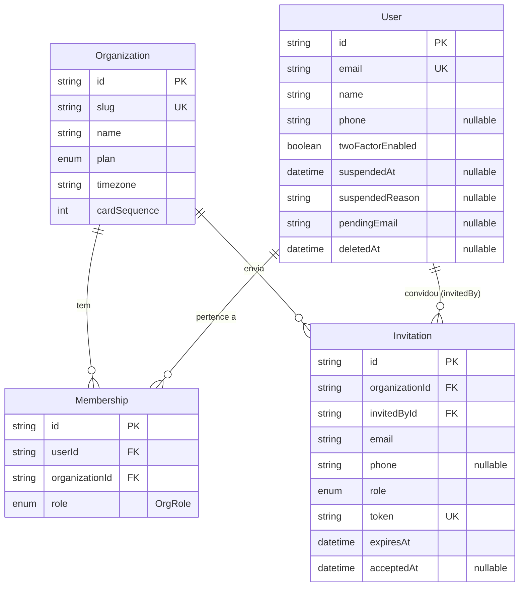
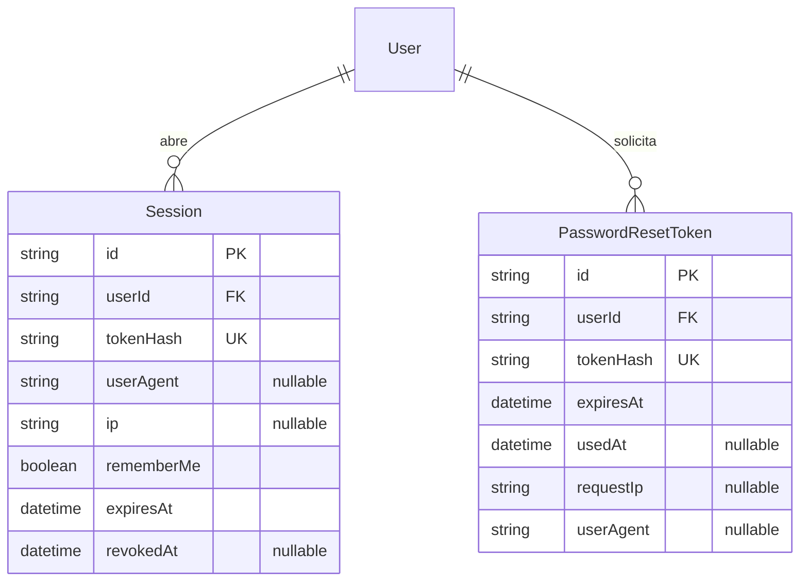
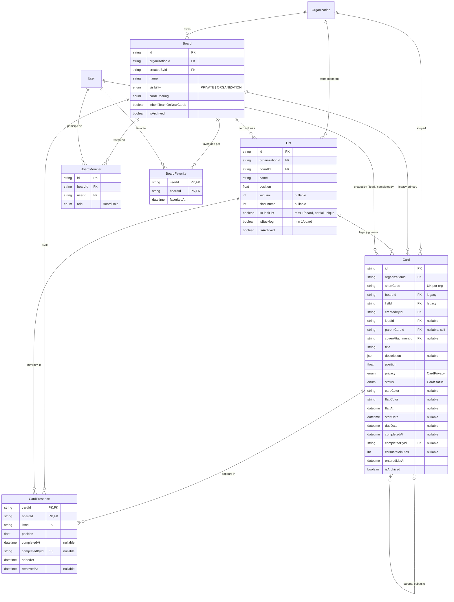
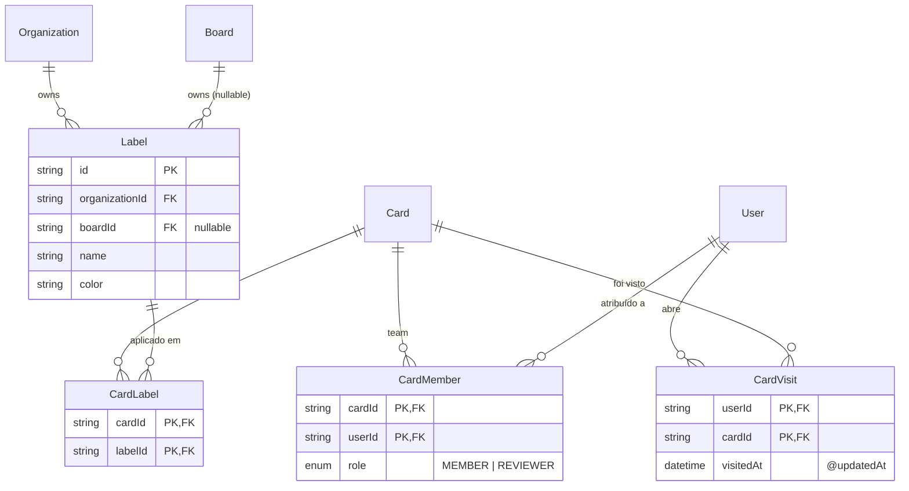
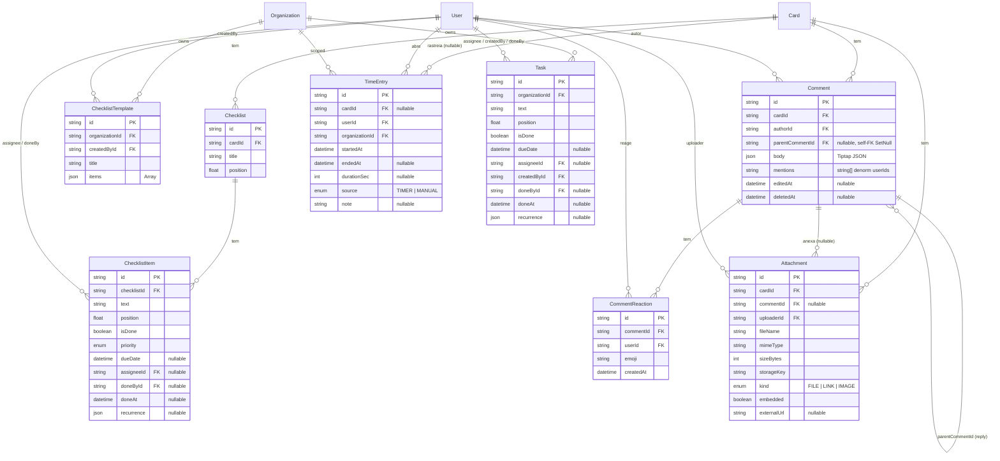
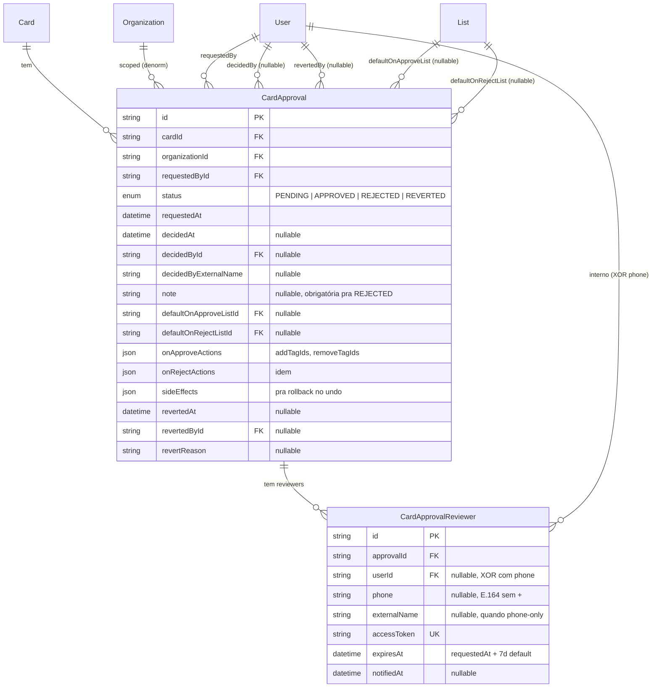
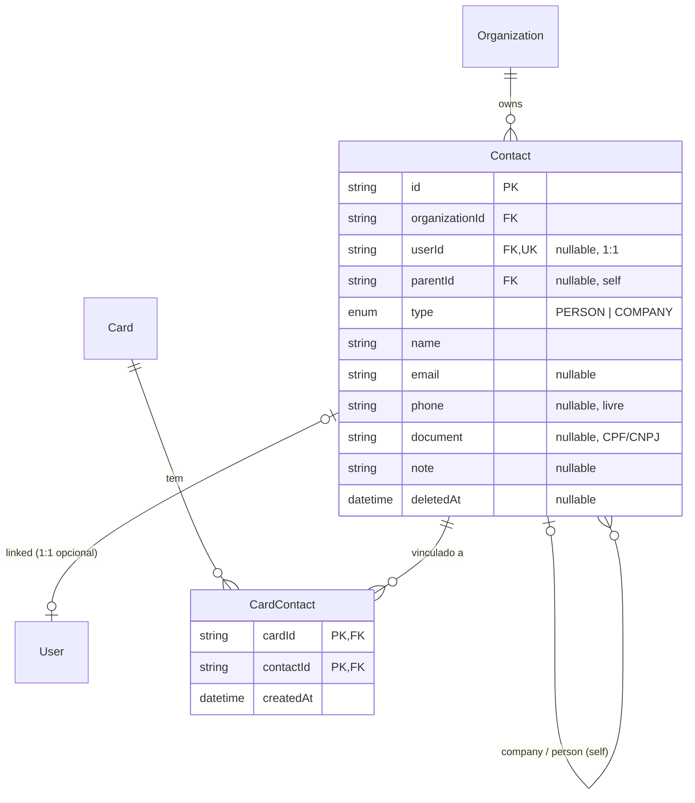
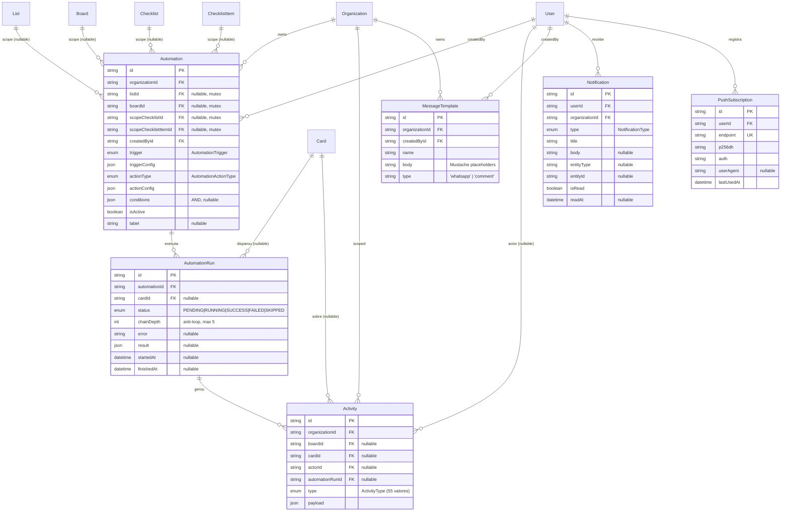
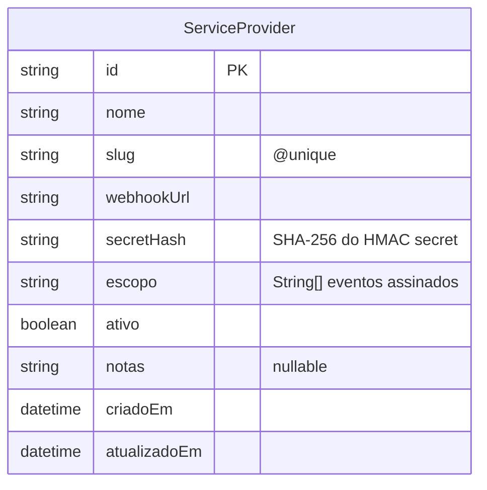

# Modelo de dados por subsistema

Seis subsistemas. Diagrama geral em [er-diagram.md](er-diagram.md). Convenções universais (timestamps, soft-delete, cascade) em [README.md](README.md).

Sumário:

1. [Tenancy](#tenancy) — `Organization`, `User`, `Membership`, `Invitation`, `Session`, `PasswordResetToken`
2. [Kanban](#kanban) — `Board`, `List`, `Card`, `CardPresence`, `BoardMember`, `BoardFavorite`, `CardMember`, `Label`, `CardLabel`, `CardVisit`
3. [Conteúdo do card](#conteudo-do-card) — `Checklist`, `ChecklistItem`, `ChecklistTemplate`, `Comment`, `Attachment`, `TimeEntry`, `Task`
4. [Aprovações](#aprovacoes) — `CardApproval`, `CardApprovalReviewer`
5. [CRM](#crm) — `Contact`, `CardContact`
6. [Automação, auditoria e mensageria](#automacao-auditoria-mensageria) — `Automation`, `AutomationRun`, `Activity`, `Notification`, `MessageTemplate`, `PushSubscription`

`OrgImportMapping` é descrito em texto na seção [Operacional](#operacional).

---

## Tenancy {#tenancy}

Modelos: `Organization`, `User`, `Membership`, `Invitation`, `Session`, `PasswordResetToken`.

Dividido em dois aspectos:

- **1.1 Identidade**: Org, User, Membership, Invitation — quem existe e em qual org.
- **1.2 Auth artifacts**: Session, PasswordResetToken — artefatos efêmeros de autenticação (mesmo arquivo, separados pra leitura).

Decisões críticas:

- `Membership` é a tabela "user pertence a org" — N:N com `id` próprio + `@@unique([userId, organizationId])`. `role` é `OrgRole` (OWNER, ADMIN, GESTOR, MEMBER, GUEST).
- `Invitation.token` é único e curto-circuita o flow de cadastro (signup via convite + envio de email/WhatsApp).
- `Session` é authoritative pra refresh: `rememberMe` controla TTL longo (90d) vs curto (1d). `tokenHash` único.
- `PasswordResetToken` é single-use (`usedAt`), TTL 1h, raw vai pro email, hash sha256 no DB.
- `User.suspendedAt` é distinto de `deletedAt`: suspensão bloqueia login mas preserva dados (admin pode reverter).
- `User.pendingEmail` permite troca de email confirmada pelo próprio user (anti-sequestro).

### 1.1 Identidade

### 1.2 Auth artifacts

Indexes/uniques relevantes:

- `Membership @@unique([userId, organizationId])`
- `Invitation.token UK`, `Session.tokenHash UK`, `PasswordResetToken.tokenHash UK`
- `Invitation @@index([expiresAt])` e `Session @@index([expiresAt])` — usados por jobs de cleanup.

---

## Kanban {#kanban}

Modelos: `Board`, `List`, `Card`, `CardPresence`, `BoardMember`, `BoardFavorite`, `CardMember`, `Label`, `CardLabel`, `CardVisit`.

Dividido em dois sub-diagramas:

- **2.1 Estrutura**: hierarquia Board → List → Card + presença multi-fluxo.
- **2.2 Equipe e labels**: associações N:N do card com User, Label, e tracking `CardVisit`.

Decisões críticas:

- **Card multi-fluxo** (`CardPresence`): card existe em N boards com `(boardId, listId, position, completedAt)` independentes. PK composta `(cardId, boardId)` garante "no máximo uma lista por board". Soft-delete via `removedAt`. Ver `tarefas-md/13-cards-multi-fluxo.md`.
- **`position` é Float** (não Int) — permite inserções entre cards sem reindexar tudo (média de vizinhos). Vale pra `List.position`, `Card.position`, `CardPresence.position`, `Checklist.position`, `ChecklistItem.position`.
- **`Card.boardId`/`listId` legacy**: durante a transição pra multi-fluxo, os FKs diretos no Card seguem vivos como "presença primária" pra leituras existentes não quebrarem.
- **`isFinalList` (max 1 por board)**: enforced por partial unique index custom criado na migration `20260508120000_unique_final_list_per_board` — não aparece no `@@unique` do schema.
- **`isBacklog` (min 1 por board)**: garantido em `ListsService` (ensureBacklogList + bloqueio no archive da última). Múltiplas backlog permitidas.
- **`Label.boardId` nullable**: label de board (atual) ou label global da org (preparado, não usado).
- **`CardVisit @@id([userId, cardId])`**: 1 row por (user, card), `visitedAt` é `@updatedAt` — upsert em vez de insert pra evitar bloat. Alimenta "Cards recentes" da home.

### 2.1 Estrutura

### 2.2 Equipe e labels

Indexes/uniques relevantes:

- `Card @@unique([organizationId, shortCode])` — `#412` único por org.
- `Card @@index([listId, position])`, `CardPresence @@index([boardId, listId, position])` — ordering kanban.
- `Card @@index([boardId, completedAt])`, `CardPresence @@index([boardId, completedAt])` — listagens "concluídos".
- `Card @@index([dueDate])` — filas temporais.
- `BoardMember @@unique([boardId, userId])`.
- `CardVisit @@index([userId, visitedAt(sort: Desc)])` — home recente.

---

## Conteúdo do card {#conteudo-do-card}

Modelos: `Checklist`, `ChecklistItem`, `ChecklistTemplate`, `Comment`, `CommentReaction`, `Attachment`, `TimeEntry`, `Task`.

Decisões críticas:

- **`Comment.body` é Json** (Tiptap) e `Comment.mentions` é `String[]` denormalizado — notificação não precisa parsear JSON.
- **`Comment.parentCommentId`** (self-FK, `onDelete: SetNull`): respostas. Preserva reply mesmo quando o pai é soft-deletado.
- **`CommentReaction`**: emoji reactions com `@@unique([commentId, userId, emoji])` — um user só pode usar o mesmo emoji uma vez por comment.
- **`Attachment.commentId` opcional**: anexo do card direto (`commentId = null`) vs anexo da timeline de um comment.
- **`Attachment.embedded`**: true = imagem dentro do corpo do Comment/descrição, não aparece na lista visual de anexos.
- **`Card.coverAttachmentId`**: 1:N reverso (um Attachment pode ser cover de muitos cards em tese, na prática 1).
- **`ChecklistItem.recurrence`** (Json): doc 49. Quando item recorrente é concluído, backend cria nova instância com `dueDate` recalculada. Sem dueDate ou sem recurrence = item normal.
- **`ChecklistTemplate.items`** (Json array de strings): só os textos. `dueDate`/`assignee`/`priority` ficam pra ajuste pós-aplicar.
- **`TimeEntry.cardId` nullable**: timer "livre" criado pelo botão do header sem contexto de card.
- **`Task`** é standalone (sem card), nível da Org. Aparece na home pessoal junto com `ChecklistItem`. Mesmo shape de `recurrence` que `ChecklistItem`.

Indexes relevantes:

- `ChecklistItem @@index([assigneeId, dueDate, isDone])` — query da home pessoal.
- `Comment @@index([cardId, createdAt])` — timeline.
- `CommentReaction @@index([commentId])` + `@@unique([commentId, userId, emoji])` — agrupamento + dedup.
- `Attachment @@index([cardId])`, `@@index([commentId])`.
- `TimeEntry @@index([userId, endedAt])` — achar entry ativa do user em O(1).
- `Task @@index([organizationId, assigneeId, isDone])`, `@@index([organizationId, dueDate])`.

---

## Aprovações {#aprovacoes}

Modelos: `CardApproval`, `CardApprovalReviewer`. Toca `List` (defaults de fallback) e `User` (4 papéis).

Decisões críticas:

- **Primeiro a votar ganha**: `CardApproval.status` muda quando qualquer reviewer decide. Reviewers restantes são informados.
- **Reviewer XOR**: `CardApprovalReviewer` é `userId` (interno) OU `phone + externalName` (externo via link tokenizado). `accessToken` único sempre presente — mesmo interno pode aprovar via link no WhatsApp/email sem login.
- **Reprovação obriga `note`** — validado no service.
- **Undo 5min**: decisor original (ou OWNER/ADMIN/GESTOR) pode reverter dentro da janela. `sideEffects` (Json) guarda o que foi feito pra rollback. `REVERTED` é status terminal.
- **Bloqueio anti-pisada**: ação humana posterior nos side-effects bloqueia o undo. Ações de automação encadeada NÃO bloqueiam — daí a importância do `Activity.automationRunId` (ver subsistema automação).
- **Fallback sem automação**: `defaultOnApproveListId`/`defaultOnRejectListId` movem o card mesmo sem regra configurada.
- **Notificação por WhatsApp**: `User.notifyApprovalsOnWhatsApp` + `User.phone` (E.164 sem `+`) acionam Evolution API quando user é reviewer.

Indexes relevantes:

- `CardApproval @@index([organizationId, status, requestedAt])` — listagem "pendentes" multi-tenant.
- `CardApprovalReviewer @@index([accessToken])` — lookup do link público.

---

## CRM {#crm}

Modelos: `Contact`, `CardContact`.

Decisões críticas:

- **`Contact.userId @unique` (1:1 opcional)**: quando setado, name/email/phone/avatar viram read-only no CRM (fonte autoritativa = User). 1 User no máximo 1 Contact. Ver `tarefas-md/50-contact-user-vinculo.md`.
- **Cross-reference sem FK**: match por email/phone com outros Users da Org é feito on-demand no frontend (sem persistir FK), pra manter entidades independentes quando o vínculo formal não existe.
- **Hierarquia B2B via self-FK** (`Contact.parentId`): PERSON pertence a COMPANY. Empresas têm `parentId = null` (validado no service). Relation name `"ContactPerson"`.
- **Soft-delete** (`deletedAt`): cards históricos seguem referenciando contatos removidos da agenda principal. Listing filtra `deletedAt: null`.
- **`CardContact` N:N puro**: PK composta `(cardId, contactId)`, sem id próprio.

Indexes relevantes:

- `Contact @@index([organizationId, type])`, `@@index([organizationId, name])`, `@@index([organizationId, email])`, `@@index([organizationId, phone])` — buscas por critério no agenda.
- `Contact @@index([parentId])` — listar PERSONs de uma COMPANY.
- `CardContact @@index([contactId])` — listar cards por contato.

---

## Automação, auditoria e mensageria {#automacao-auditoria-mensageria}

Modelos: `Automation`, `AutomationRun`, `Activity`, `Notification`, `MessageTemplate`, `PushSubscription`.

Os três blocos vivem juntos porque `Activity.automationRunId` linka audit log à execução, `MessageTemplate` alimenta as actions `SEND_WHATSAPP`/`POST_COMMENT`, e `PushSubscription` é o canal de delivery das `Notification` geradas pela engine.

Decisões críticas:

- **`Automation` escopo mutex**: cada regra pertence a `list` OU `board` OU `org` OU `scopeChecklist` OU `scopeChecklistItem` (validado no service). Triggers temporais usam list/board/org; `CHECKLIST_ITEM_DONE` e `CHECKLIST_COMPLETED` usam scopeChecklist/Item.
- **`triggerConfig` e `actionConfig` (Json)**: shape varia por enum. Ex: `triggerConfig = { minutes: 60 }` pra TIME_IN_LIST; `actionConfig = { tagIds: [...] }` pra INSERT_TAGS.
- **`conditions` (Json)**: array AND, cada item é `AutomationCondition`. Avaliado em `executeAutomation` antes da action. Null = sempre roda.
- **`chainDepth=5`** anti-loop — engine aborta acima disso.
- **`Activity.automationRunId`**: crítico pro undo de aprovação. `IS NULL` = ação humana (bloqueia undo); `NOT NULL` = ação de automação encadeada (não bloqueia).
- **`Activity.payload` (Json)**: shape varia por `ActivityType` (55 valores).
- **`MessageTemplate.type`**: discriminador `'whatsapp'` | `'comment'` pra autocomplete não cruzar contextos.
- **`PushSubscription.endpoint UK`** globalmente. `410 Gone` no envio → registro removido automaticamente.

Indexes relevantes:

- `Automation @@index([listId, isActive])`, `@@index([boardId, isActive])`, `@@index([scopeChecklistId, isActive])`, `@@index([scopeChecklistItemId, isActive])` — engine resolve "quais regras pra esse evento".
- `AutomationRun @@index([automationId, createdAt])`, `@@index([cardId])` — debug e histórico.
- `Activity @@index([organizationId, createdAt])`, `@@index([cardId, createdAt])`, `@@index([boardId, createdAt])`, `@@index([automationRunId])` — feed e undo.
- `Notification @@index([userId, isRead, createdAt])` — sino do header.
- `MessageTemplate @@index([organizationId, type])`.

---

## IDP / Federação {#idp-federacao}

Modelos: `ServiceProvider`.

Subsistema **global** (sem `organizationId`) gerido pelo admin de plataforma (`User.isPlatformAdmin`). Cada row é um Service Provider externo (ex: Ogma) que recebe webhooks de eventos sensíveis disparados pelo KTask.

Decisões críticas:

- **Sem `organizationId`**: deliberado. Federação IdP é responsabilidade do KTask como Identity Provider — quem decide quais SPs existem é o admin global, não cada Org. Se isso virar self-service por Org, adicionar FK depois.
- **`slug @unique`**: identificador estável usado em logs e nas URLs internas (`ogma`, `creatyze-atendimento`).
- **`secretHash` (SHA-256)**: plaintext nunca é armazenado. Mostrado 1 vez ao admin na criação. Verificação HMAC quando o webhook é assinado.
- **`escopo String[]`**: lista de eventos assinados pelo SP. Hoje: `usuario.email_alterado`, `usuario.senha_alterada`, `usuario.desativado`. Sem enum porque eventos novos não exigem migration — só código novo no dispatcher.
- **`ativo Boolean`**: kill switch sem deletar. Quando false, o dispatcher pula esse SP.

Sem relação direta com nenhum outro model — é uma tabela de configuração. Os webhooks dispatchados são fire-and-forget; sucesso/falha de entrega fica em logs do API, não no banco.

Plano completo da federação em [tarefas-md/51-federacao-idp-para-ogma.md](../../tarefas-md/51-federacao-idp-para-ogma.md).

---

## Operacional {#operacional}

Modelo não-domínio que vale citar:

**`OrgImportMapping`** — memória de mapeamentos do importer (CSV Ummense). Quando o user mapeia "Thiago" (CSV) → Thiago Bueno (User do KTask) em `/configuracoes/importar`, persistimos pra próximo import já chegar pré-mapeado. Shape: `(organizationId, kind, sourceName) → targetId | null` com upsert. `kind` é `'user'` ou `'list'` (string solta, sem enum, pra permitir extensão futura). `targetId = null` significa "Ignorar este nome, não perguntar de novo". Unique composto `@@unique([organizationId, kind, sourceName])`.

Sem diagrama dedicado — entidade isolada, FK só pra `Organization`.
