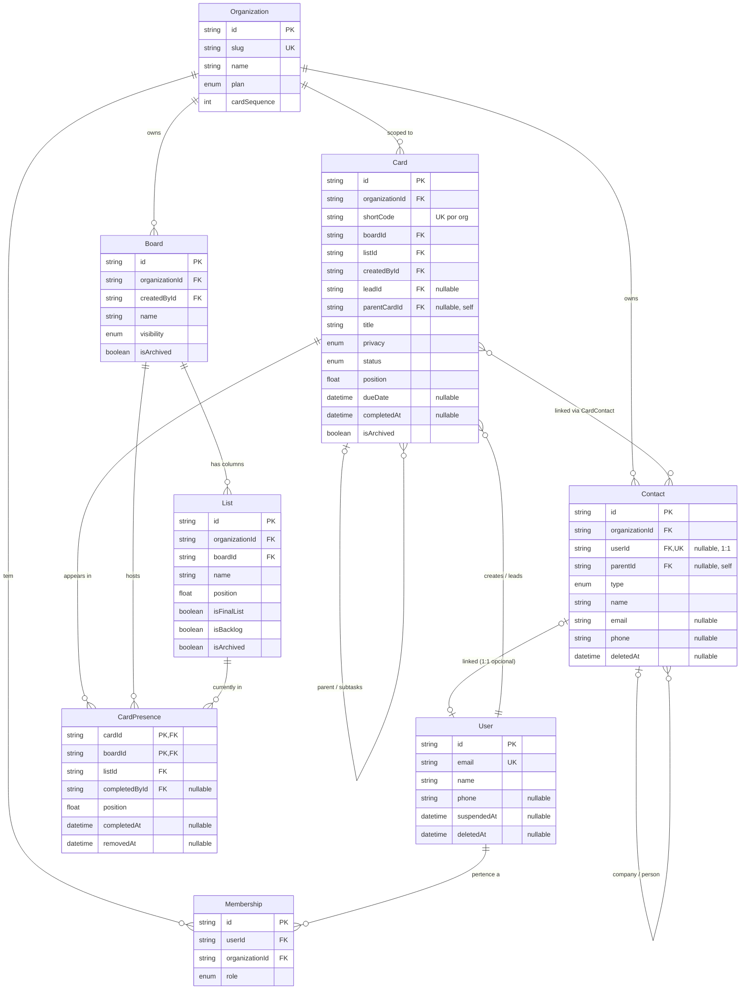

# Diagrama ER — visão geral

Eixo principal do modelo: oito entidades que estruturam o produto. Detalhes por área (conteúdo do card, aprovações, automação, etc.) ficam em [er-by-area.md](er-by-area.md).

Convenções do diagrama:

- Campos `createdAt`/`updatedAt`/`deletedAt` omitidos (ver [README](README.md)).
- `PK,FK` indica chave primária composta cuja coluna também é FK (caso de `CardPresence`).
- `UK` marca colunas únicas (incluindo unique composto explicitado no comentário).
- `CardContact` aparece só como relação N:N entre `Card` e `Contact` (a tabela join é mostrada no [diagrama de CRM](er-by-area.md#crm)).

## Leitura do diagrama

- **Tenant boundary**: `Organization` é raiz de cascade em quase tudo. `User` é multi-tenant via `Membership` (um user pode pertencer a várias orgs com `role` diferentes).
- **Hierarquia kanban**: `Organization → Board → List`. `Card` referencia `boardId`+`listId` diretos (legacy do modelo single-board, preservado pra leitura rápida).
- **Multi-fluxo**: `CardPresence` é onde o card "aparece" — PK composta `(cardId, boardId)` garante "no máximo uma lista por board". A presença com `boardId == Card.boardId` é a "primária".
- **Família de cards**: `Card.parentCardId` é self-FK opcional (`onDelete: SetNull`).
- **CRM 1:1**: `Contact.userId` é unique e nullable — quando setado, o CRM trata identidade do User como fonte de verdade (read-only).
- **CRM hierárquico**: `Contact.parentId` self-FK liga uma `PERSON` à `COMPANY` dela.

Fora deste diagrama mas no eixo do produto (ver [er-by-area.md](er-by-area.md)):

- Conteúdo do card: `Checklist`, `ChecklistItem`, `Comment`, `Attachment`.
- Aprovações: `CardApproval`, `CardApprovalReviewer`.
- Time/etiquetas: `CardMember`, `Label`, `CardLabel`, `CardVisit`, `BoardMember`, `BoardFavorite`.
- Automação e auditoria: `Automation`, `AutomationRun`, `Activity`.
- Mensageria: `Notification`, `MessageTemplate`, `PushSubscription`.
- Produtividade pessoal e ops: `Task`, `TimeEntry`, `OrgImportMapping`.
